# MFSW Controller

The **MFSW Controller** is designed to allow control between PQ and MQB chassis and steering wheels on VAG and used as a man-in-the-middle adapter to control different steering wheels fitted into different marques.  It **reads button presses and backlight data from the steering-wheel LIN bus**, **re-maps** each new button to
whatever your old hardware expects, and **sends** the result on up to four output
channels at once: a **translated LIN frame**, a **CAN broadcast**, a **resistive
(digital-potentiometer) line** for legacy resistor based radios (up to 10k), and a **high-side
driver output** for switching a relay or light. An optional PWM **auxiliary light input** feeds
automatic backlight dimming (for MK4 chassis, etc), and everything is configured from a phone over **Wi-Fi** —
no laptop or serial cable needed in the car.

It runs on an **ESP32 DevKit V1 (WROOM-32)** under the Arduino framework, and uses the
[LIN_master_portable_Arduino](https://github.com/gicking/LIN_master_portable_Arduino)
library for the LIN state machines, the ESP32 **TWAI** peripheral for CAN, and
[X9C10X](https://github.com/RobTillaart/X9C10X) for the digital potentiometer.

> The buttons are designed with a known-good PQ baseline that you re-learn to suit your wheel.

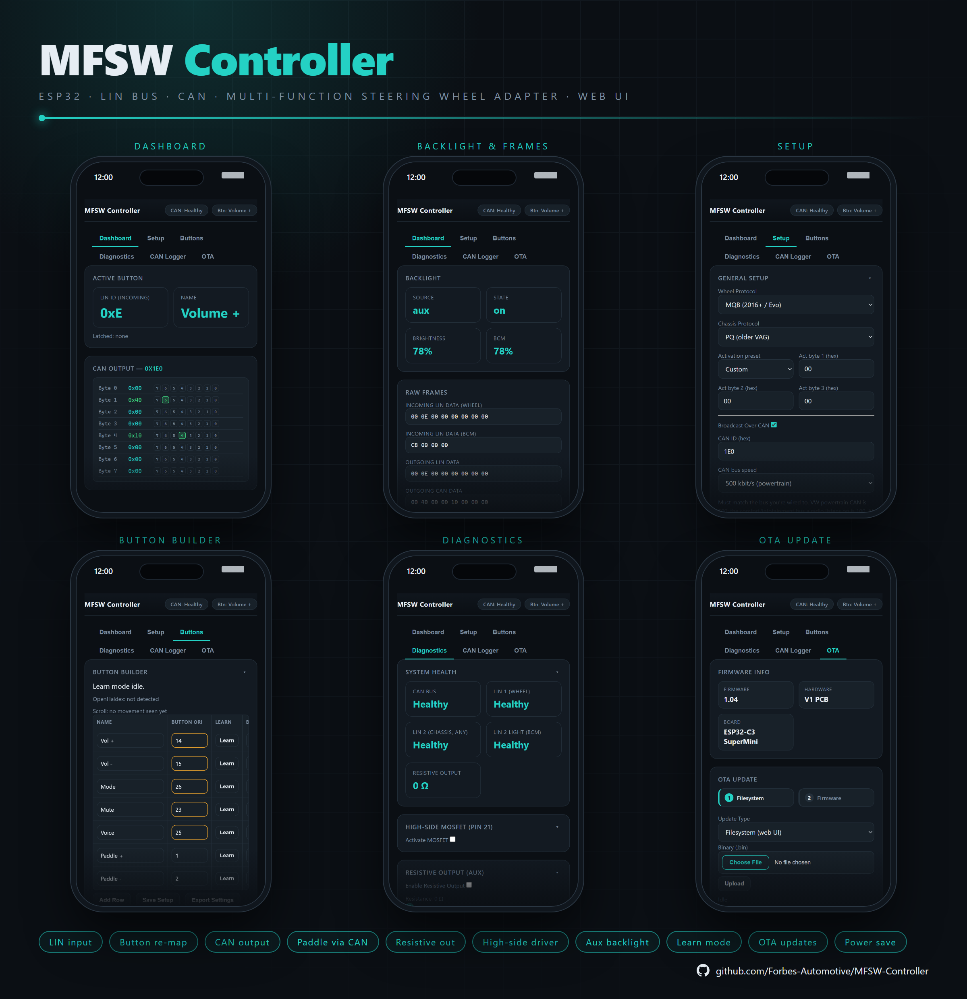

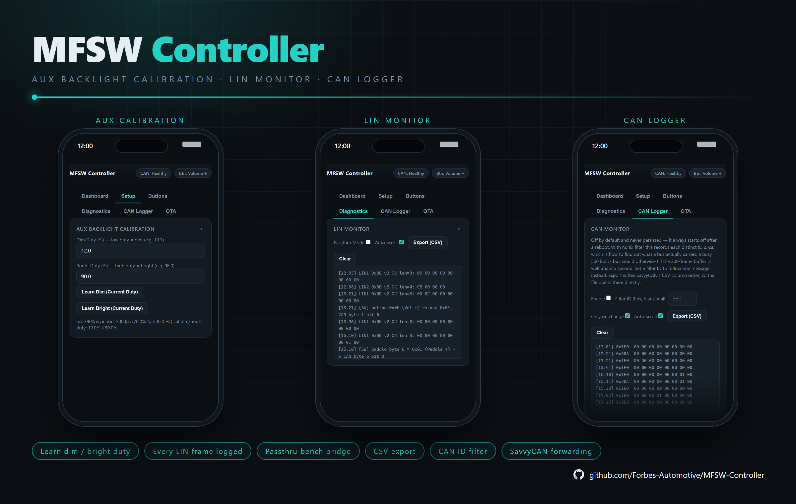

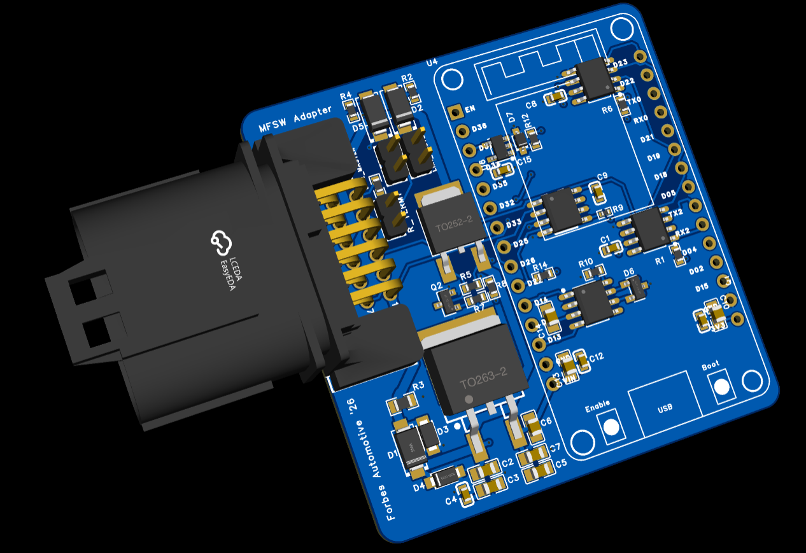

---

## Features at a Glance

| Feature | Detail |
|---|---|
| LIN input (wheel) | Polls the steering-wheel LIN bus (default ID `0x0E`) for button IDs and paddle state at 19.2 kbit/s |
| LIN light input | Reads chassis-bus dimming (default ID `0x0D`) to drive the wheel backlight |
| Accessory buttons | Polls a second wheel frame (default ID `0x0F`) and feeds its buttons through the same mapping pipeline |
| Temperature frame | Polls a wheel temperature frame (default ID `0x3A`) for display in the LIN monitor |
| Configurable LIN IDs | All four incoming frame IDs are user-editable, so wheels using non-standard IDs are supported |
| Wheel protocol | Selectable PQ / MQB wheel protocol; MQB wheels are enabled with a different backlight activation frame |
| Chassis protocol | Independent PQ / MQB selector for the button frame sent to the chassis/BCM — any wheel↔chassis combination bridges (PQ↔PQ, PQ↔MQB, MQB↔PQ, MQB↔MQB) |
| Protocol-aware button codes | Changing either protocol offers to update known PQ/MQB button codes to match — rows already learned or customised are left alone |
| BCM live status | Dashboard shows the chassis LIN light frame's brightness and raw bytes independently of the active backlight source, so BCM presence is visible even under Aux/Forced |
| Settings import/export | Back up and restore the full configuration (including the button map) as a JSON file |
| LIN monitor | A live event log of button and accessory activity, exportable as CSV, viewable and clearable from the UI |
| Passthru mode | Diagnostic bypass: relays LIN frames unmodified between the wheel and chassis buses and logs every attempt — success or failure, any length — instead of only successful, changed frames |
| Legacy PCB mode | Reverses RX/TX on **both** LIN channels for older boards (applied at boot) |
| Button re-mapping | Up to **24** mappings, each with a name, original ID, new LIN ID, CAN bit, resistance and flags |
| LIN output | Sends the translated button as a LIN master request on the chassis bus (configurable ID) |
| CAN output | Broadcasts an 8-byte button frame (configurable ID, default `0x1E0`) on 500 kbit/s TWAI |
| Paddle via CAN | Emits a GRA (cruise/shift) frame (`0x38A`) carrying paddle up/down |
| Resistive output | Drives an X9C10X digital pot to emulate a resistor-ladder radio input (per button specified ohms) |
| High-side driver | Switchable output (up to 5A) — momentary or latched per button, plus diagnostic override |
| Latching outputs | Latch a button to hold its high-side, CAN and LIN outputs active until it is pressed again |
| OpenHaldex control | Command an **OpenHaldex** mode from a button — a fixed mode or **Push-to-Next**, with closed-loop confirmation over CAN |
| Aux backlight | PWM light input decoded to a brightness %, with learnable dim/bright duty calibration |
| Forced / source-select backlight | Choose Aux PWM, forced fixed %, or pass-through LIN brightness |
| Learn mode | Capture a wheel's button IDs and aux duty limits directly from the live bus |
| Wi-Fi UI | Dashboard, setup, button builder, diagnostics, OTA |
| OTA updates | Flash new firmware from the browser over Wi-Fi |
| Bus health | Live CAN / LIN 1 / LIN 2 / resistive status in the UI |
| Power management | Auto Wi-Fi-off + CPU reduction 1 min after the last client disconnects |
| EEPROM | All settings and the button map stored to ESP32 Preferences |

---

### Purchase
If you want to purchase an assembled controller, you can do so here: [LIN MFSW Controller - Forbes Automotive](https://forbes-automotive.com/products/lin-mfsw-controller)

## Compatibility

Designed for VAG multi-function steering wheels that report buttons over a **LIN slave
response** and (optionally) carry paddle shifters and a LIN-dimmed backlight. Button IDs,
LIN frame IDs and the CAN/GRA frame set are **car- and wheel-specific** — treat the
shipped `buttonMappings[]` table (in [src/globals.cpp](src/globals.cpp)) as a known-good
baseline and re-learn each button to suit your hardware. Both **PQ** and **MQB** are
supported on **each side independently** — pick the wheel family in **Setup → Wheel
Protocol** and the chassis/BCM family in **Setup → Chassis Protocol** (see
[LIN Frame Structure](#lin-frame-structure--protocols)), so any combination bridges:
PQ↔PQ, PQ↔MQB, MQB↔PQ, MQB↔MQB. If your wheel's buttons aren't recognised at all, watch
the **LIN Monitor** while pressing them to find the frame and byte that change.

> Frame IDs and calibration live in [include/defs.h](include/defs.h) and
> [src/globals.cpp](src/globals.cpp). The resistive output values are tuned to your
> radio's resistor ladder — characterise them with the **Test Resistance** diagnostic or a datasheet for your radio.

---

## Hardware Overview

### External Interfaces

| Function | Part / circuit |
| --- | --- |
| Steering-wheel LIN (LIN 1) | LIN transceiver on `Serial1`, 19.2 kbit/s — the steering wheel is the slave, this device is master |
| Chassis LIN (LIN 2) | LIN transceiver on `Serial2`, 19.2 kbit/s — reads light dimming value from chassis, sends translated buttons |
| CAN | ESP32 TWAI + transceiver (TJA1050 / SN65HVD230), 500 kbit/s |
| Aux light input | 12V PWM dimming signal → level-shifted / opto-isolated |
| Resistive output | X9C10X digital potentiometer for the radio's resistor values |
| High-side driver | Transistor output (OUTPUT1) for a relay / light (5A max.) |

### Pin Map

Defined in [include/defs.h](include/defs.h):

| Group | Signal | GPIO |
| --- | --- | --- |
| LIN 1 (wheel) | TX / RX | 17 / 16 |
| LIN 2 (chassis) | TX / RX | 23 / 22 |
| LIN 2 | Wake / CS | 18 / 19 |
| CAN / TWAI | RX / TX | 13 / 14 |
| Aux light | PWM input (input-only pin) | 39 |
| Resistive pot (X9C10X) | UD / INC / CS | 25 / 26 / 27 |
| High-side driver | Output ("High-Side MOSFET") | 21 |

### Main Connector

The device breaks out to a single 12-way **MX23A12NF1** connector:

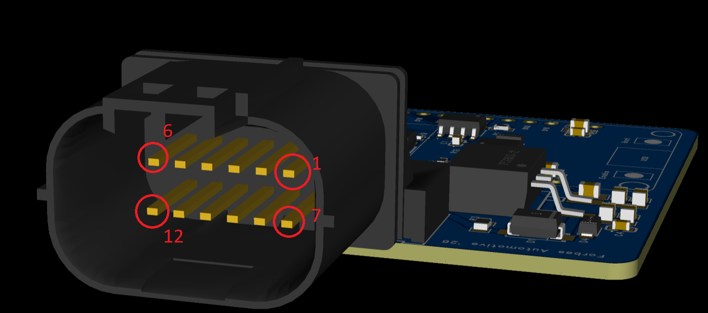

> Viewed into the mating face: the top row runs pin **1** (right) to pin **6** (left), and
> the bottom row runs pin **7** (right) to pin **12** (left).

| Pin | Signal | Notes |
| --- | --- | --- |
| 1 | `PWR_IN` | 12 V switched / ignition supply |
| 2 | `GND` | Ground |
| 3 | `LIN1` | Steering-wheel LIN bus |
| 4 | `LIN2` | Chassis LIN bus |
| 5 | `CHASSIS_CANH` | CAN high |
| 6 | `CHASSIS_CANL` | CAN low |
| 7 | `ANALOG_LIGHT_IN` | PWM auxiliary backlight input |
| 8 | `RA` | Resistive output (digital-pot wiper to the radio) |
| 9 | `5V` | 5 V rail - typically not required |
| 10 | `OUTPUT1` | High-side driver output |
| 11 | — | Unused |
| 12 | — | Unused |

---

## Jumpers

A set of on-board jumpers lets you adapt the board to the chassis without changing firmware.

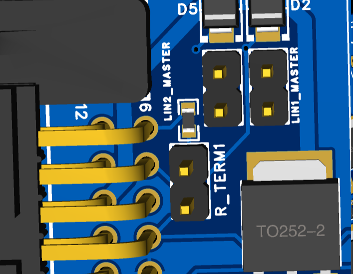

### LIN1_MASTER

Enables the master pull-up on **LIN 1** (the steering-wheel bus). This device is the master
on the wheel bus, so this jumper should normally remain fitted.

### LIN2_MASTER

Enables the master pull-up on **LIN 2** (the chassis bus). Fit it when the adapter is the
master driving the chassis LIN output; remove it if another module already provides the
master pull-up on that bus.

### R_TERM1

The **CAN bus termination resistor**. If this is the only device on the CAN network, leave
the jumper fitted. If other devices already terminate the bus, remove it.

---

## How It Works

The steering wheel LIN bus, the chassis LIN bus and the CAN bus are ran by dedicated FreeRTOS
tasks. A single steering wheel task owns both LIN state machines sequentially (guarded by
mutexes) to avoid corrupting the shared LIN peripheral, and a separate output task decides what data to send - either LIN, CAN, the high-side driver or the resistive line.

```
Steering-wheel LIN (0x0E)          Chassis LIN light (0x0D)         Paddle bits
        │                                  │                             │
        ▼ steeringWheelLinTask (core 1)    ▼ getLightLINFrame()          ▼ broadcastGRATask
 read button ID + paddles           read dimming %               GRA frame 0x38A
        │                                  │                             │
        ▼ sendButtonLINFrame()             ▼ updateBacklightState()      ▼ (if Paddle via CAN)
 look up mapping ──────────────┐    aux / forced / LIN source
        │                      │           │
        │                      │           ▼ sendLightLINFrame() → wheel backlight
        ▼                      ▼
 chassis LIN out         canHoldFrame[] (bit set)
 (if LIN Output on)            │
                              ▼ debounceOutputTask (core 0, ~20 Hz)
                    ┌──────────┼─────────────────────┐
                    ▼          ▼                     ▼
             CAN broadcast   high-side driver   resistive output (X9C10X)
             (0x1E0, if on)  (momentary/latch)  (per-button ohms)
```

### Button Mapping

Each of the up to 24 rows in the button map carries:

| Field | Meaning |
| --- | --- |
| **Name** | Purely for understanding, not used in code (e.g. `Volume +`) |
| **Button ID_LIN (original)** | The raw ID reported by the wheel — learnable |
| **Button ID_LIN (new)** | The ID re-emitted on the chassis LIN output — learnable |
| **CAN Byte / Bit** | Which bit of the 8-byte CAN frame to set (byte `0xFF`/255 = no CAN) |
| **Resistive Output (Ohm)** | Resistance to present on the X9C10X while held (0 = none) |
| **MOSFET** | Flag: drive the high-side output while pressed |
| **Latch** | Flag: toggle the button on/off on each press instead of momentary. While latched, its high-side, CAN and LIN outputs stay active until pressed again |
| **OpenHaldex** | Flag: this button commands an OpenHaldex mode change (**exclusive** — its MOSFET/CAN/LIN/resistive outputs are suppressed) |
| **OH Mode** | The OpenHaldex mode to set: a fixed mode (Stock, FWD, 50:50, 60:40, 75:25, Expert) or **Push-to-Next** to step through the modes and roll over |

When a mapped button is seen, its CAN bit is held for the configurable **Send on CAN**
window (`canHoldMs`, 50–5000 ms) so brief presses still produce a clean pulse.

Changing **Wheel Protocol** or **Chassis Protocol** prompts to update the rows the firmware
independently knows both a PQ and MQB code for (see the button code table under
[LIN Frame Structure](#lin-frame-structure--protocols)) — a row already learned or typed to a
real-world value no longer matches either known code, so it's left alone automatically. If
none of your rows are on a recognised code, the prompt says so instead of offering to change
anything.

### OpenHaldex Control

A button flagged for **OpenHaldex** commands a mode change on an **OpenHaldex**
unit sharing the chassis CAN bus.
The controller sends the requested mode on the external-control frame (`0x6A0`, `data[0]`
= mode) and then watches the OpenHaldex broadcast (`0x6B0`, `data[6]` = current mode) to
confirm it took effect, resending until the reported mode matches (or a 3-second timeout).
**Push-to-Next** advances one mode per press using the last broadcast mode as its
reference, rolling over after Expert. The Buttons tab shows the live OpenHaldex mode.

> The OpenHaldex unit must have its **broadcast-over-CAN** option enabled — it is required
> both to accept external mode commands and to provide the confirmation broadcast.

### Backlight Sources

`updateBacklightState()` picks a brightness in priority order:

1. **Aux** — decode the PWM duty on GPIO 39, map it between the learned dim/bright duty
   limits to the LIN brightness range (0–`0x7F`).
2. **Forced** — hold a fixed user-set percentage.
3. **LIN pass-through** — forward the chassis-bus dimming value read from ID `0x0D`.

The Aux input is measured by an edge ISR that accumulates period/on-time over a 1-second
window and averages hundreds of cycles to cancel optocoupler jitter.

---

## LIN Frame Structure & Protocols

This controller is the LIN **master**: it sends a frame header and the wheel (the slave)
replies. Because it's master on both buses, it can only ever see responses to headers it
generates for its own configured IDs — it can't passively sniff arbitrary unknown traffic,
since nothing else on either bus is a second master. PQ and MQB are supported on **each
side independently**: **Setup → Wheel Protocol** bridges what's sent to the wheel, and
**Setup → Chassis Protocol** bridges what's sent to the chassis/BCM — so any combination of PQ↔PQ,
PQ↔MQB, MQB↔PQ, MQB↔MQB can be bridged.

### Backlight / activation frame — ID `0x0D` (master → wheel)

Published every cycle. Byte 0 is live brightness (`0`–`0x7F`). The remaining bytes differ by
protocol and, on MQB, act as an **enable gate**: the wheel refuses to report buttons until it
sees a valid activation frame (it will still light its backlight, which is why a wheel can
look "alive" yet report no buttons).

| Protocol | Byte 0 | Byte 1 | Byte 2 | Byte 3 |
| --- | --- | --- | --- | --- |
| PQ | brightness | `0xF9` | `0xFF` | `0xFF` |
| MQB (2016+) | brightness | `0xFF` | `0x00` | `0x00` |
| MQB Evo (2020+) | brightness | `0x81` | `0x64` | `0x40` |

### Button frame — ID `0x0E` (wheel → master)

8 data bytes followed by the checksum. The button code is read from **byte 1** (configurable
via *Button data byte*). MQB layout, from real gateway captures:

| Byte | Meaning |
| --- | --- |
| 0 | rolling counter (ignored) |
| 1 | button 1 code |
| 2 | button 2 code (for simultaneous presses) |
| 3 | press duration 1 |
| 4 | wheel type (e.g. `0xA3` Skoda, `0x90` VW) |
| 5 | press duration 2 |
| 6 | paddles |
| 7 | status / errors (horn, etc.) |

MQB button codes (byte 1): `02` Src+, `03` Src−, `04` Menu▲, `05` Menu▼, `07` OK, `10` Vol+,
`11` Vol−, `15` Next, `16` Prev, `19` Voice, `23` View, `74` Cruise. PQ wheels report their
own codes — use **Learn** to capture whatever your wheel sends.

These are also the PQ/MQB pairs the **Setup → Wheel/Chassis Protocol** change prompt (see
[Button Mapping](#button-mapping)) knows how to translate for the matching row — every other
button in the shipped table (Phone, Voice/Mic ACC ×2, Paddle +/−, Paddles-both, Horn) isn't
in this documented list, so that prompt leaves those rows untouched rather than guess.

### Chassis-bound button frame — ID `0x0E` (master → chassis/BCM)

The translated button code always sits in **byte 1**; the surrounding bytes are shaped by
**Chassis Protocol** and otherwise carry no meaning of their own:

| Protocol | Byte 0 | Byte 1 | Byte 4 |
| --- | --- | --- | --- |
| MQB (default) | `0x00` | button code | `0x00` |
| PQ | rolling counter \| `0x80` | button code | `0x60` |

MQB is today's original, already-validated shape. The PQ shape is modelled on
[Dimka8901/MQB-MFSW-PQ25](https://github.com/Dimka8901/MQB-MFSW-PQ25)'s `mqbToPq()` — worth
confirming against a real PQ chassis capture, it hasn't been independently verified against
real hardware here.

### Checksum

Both protocols use the LIN 2.x **enhanced** checksum (sum of the PID and all data bytes,
folded to a byte and inverted), applied automatically by the LIN library — every transaction
always requests V2. Passthru Mode's log notes this (`v2`) alongside a precise failure reason
(`TIMEOUT` / `CHK` / `ECHO` / `STATE`) when a frame doesn't validate, but it can't also report
whether the same bytes would have validated under classic V1 instead — the library only
exposes the data bytes and an aggregate error flag to application code, not the raw
PID/checksum bytes an independent recheck would need.

### Process

1. **Send `0x0D`** — brightness + activation bytes. Keeps the wheel awake and, on MQB,
   unlocks the button report.
2. **Poll `0x0E`** — read the button code from byte 1 and paddle bits from byte 6.
3. **Map** the code through the button table to the CAN / resistive / LIN / high-side outputs.

> **Passthru Mode** (Diagnostics → LIN Monitor) bypasses this process entirely: frames are
> relayed unmodified between the wheel and chassis buses instead of mapped/editted, and
> every poll/send attempt is logged — see [LIN Monitor](#lin-monitor) below.

---

## Wi-Fi & Web Interface

Connect to the **`MFSWController`** Wi-Fi access point (open network) and browse to
**`http://192.168.1.1/`** or **`http://mfsw.local/`**. All changed settings are automatically saved. Current firmware version: **1.04** — this project's shared theme, Wi‑Fi manager and OTA manager are in fact the **origin** of the common modules now used across OpenHaldex, Can2Cluster, SpeedPulser, SpeedPulserPro, can2rpm and AirLift Controller.

| Tab | Purpose |
| --- | --- |
| **Dashboard** | Live active button (LIN ID + resolved name), CAN output frame with per-bit view, backlight source/state/brightness plus an independent **BCM** brightness tile, and raw incoming (wheel **and** BCM) / outgoing LIN + CAN frames |
| **Setup** | **Wheel Protocol (PQ / MQB)** with an MQB activation preset, independent **Chassis Protocol (PQ / MQB)**, Broadcast-over-CAN toggle + CAN ID, Paddle via CAN, Send-on-CAN window, aux-light source, force backlight + brightness slider, LIN output enable + ID, **Legacy PCB (swap LIN RX/TX)**, the four **incoming LIN IDs** (button / accessory / temperature / light), and aux dim/bright duty calibration with **Learn** buttons |
| **Buttons** | The button builder table — add/delete up to 24 rows, edit every field, **Learn** original/new LIN IDs directly from the wheel, assign latch or OpenHaldex control per button (with a live OpenHaldex mode readout), and **Export / Import** the whole configuration as JSON |
| **Diagnostics** | Bus health (CAN / LIN 1 / LIN 2 — split into "any transaction" and "light frame specifically" / resistive), High-Side MOSFET test toggle, resistive-output hold, a stepped Test Resistance probe, and a live **LIN Monitor** log with **Passthru Mode** and CSV **Export** |
| **CAN Logger** | A **CAN Monitor** that records frames seen on the bus (optionally one CAN ID only, and only when the bytes change) with SavvyCAN-ordered CSV export, plus the **SavvyCAN Analyzer** toggles to forward all traffic over WiFi (GVRET) or USB serial — see [CAN Logger](#can-logger) below |
| **OTA** | Two-step firmware/web-UI update over Wi‑Fi — see [Over-the-Air Updates](#over-the-air-updates-two-step) below |


<p align="center">
  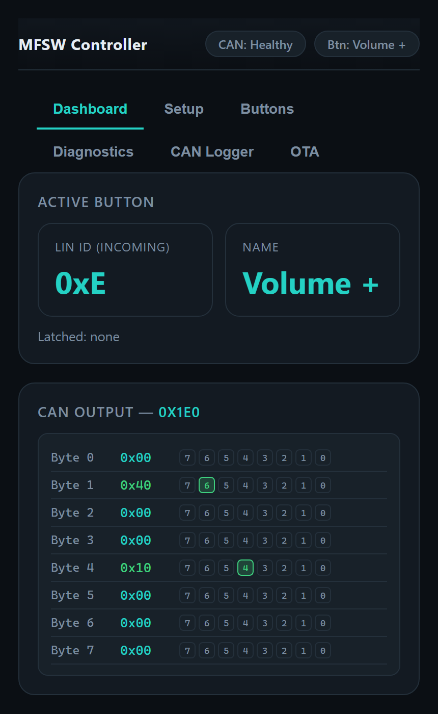
  &nbsp;&nbsp;
  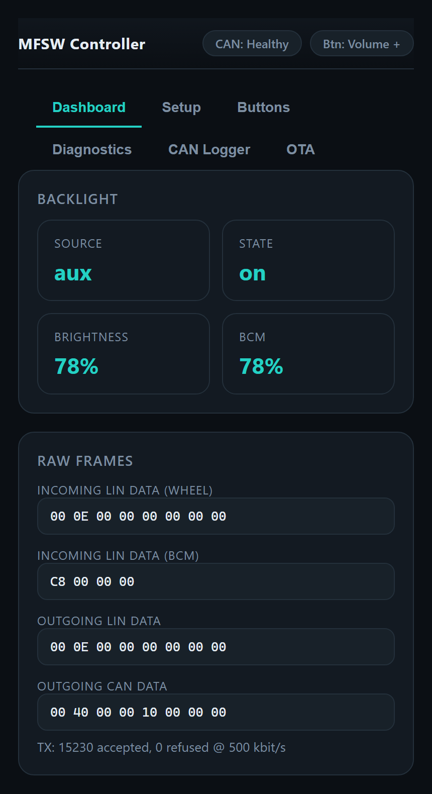
</p>

*Dashboard: the last button seen and the CAN frame it produced (left); backlight source / brightness alongside the BCM's own value, and the raw wheel, BCM and outgoing frames (right).*

<p align="center">
  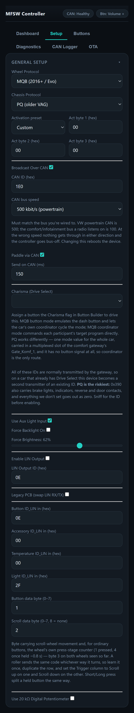
  &nbsp;&nbsp;
  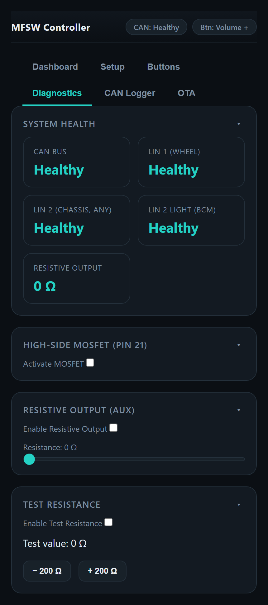
</p>

*Setup: the whole General Setup card, top to bottom (left); Diagnostics: bus health tiles, the high-side test toggle and the resistive-output tools (right).*

### Over-the-Air Updates (Two-Step)

Firmware and the web UI live on separate flash partitions, so an update on the **OTA** tab is done in two steps:

1. **Filesystem** — upload `littlefs.bin` (`POST /api/ota/fs`, written to the SPIFFS partition). Updates `index.html` / `app.js` / `style.css`; the device does **not** reboot after this step.
2. **Firmware** — upload `firmware.bin` (`POST /api/ota`, written to the OTA app partition). Updates the application and reboots automatically once complete.

The OTA tab's step tracker highlights the step in progress and marks each with a green checkmark as it completes. `GET /api/ota/info` reports the running version.


<p align="center">
  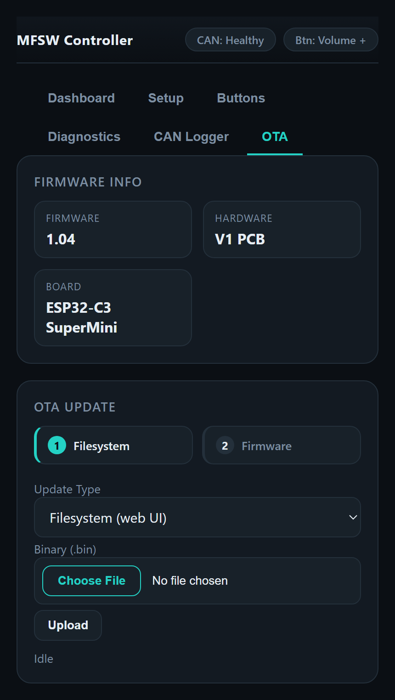
</p>

### Status Indicators

The Dashboard/Diagnostics header badges (`CAN: ...`, `Active Button: ...`) and the CAN/LIN/resistive health tiles are currently rendered as **plain text in the default accent colour** rather than colour-coded green/red — in this firmware build the healthy/unhealthy states aren't yet wired to the shared theme's green/orange/red pill classes, so read the text itself (e.g. "Healthy" / "No Data" / "Idle" / "Disabled") rather than relying on colour. The one place colour *is* live is the OTA step tracker above (teal = step in progress, green = step complete).

---

### Learn Mode

Learn mode captures live values from the bus into a specific field:

- **Button IDs** — press *Learn* on a row's original or new LIN column, then press the
  physical control. Learn snapshots the idle frame and captures the **first byte that
  changes** (ignoring the rolling counter), so ordinary buttons (byte 1), **paddles**
  (byte 6) and the **horn** (byte 7) are all captured with their correct byte position and
  value. Learn windows time out after 5 seconds.
- **Aux duty limits** — with a PWM light signal present, *Learn Dim* / *Learn Bright*
  capture the current duty (in tenths of a percent) as the calibration endpoints.


<p align="center">
  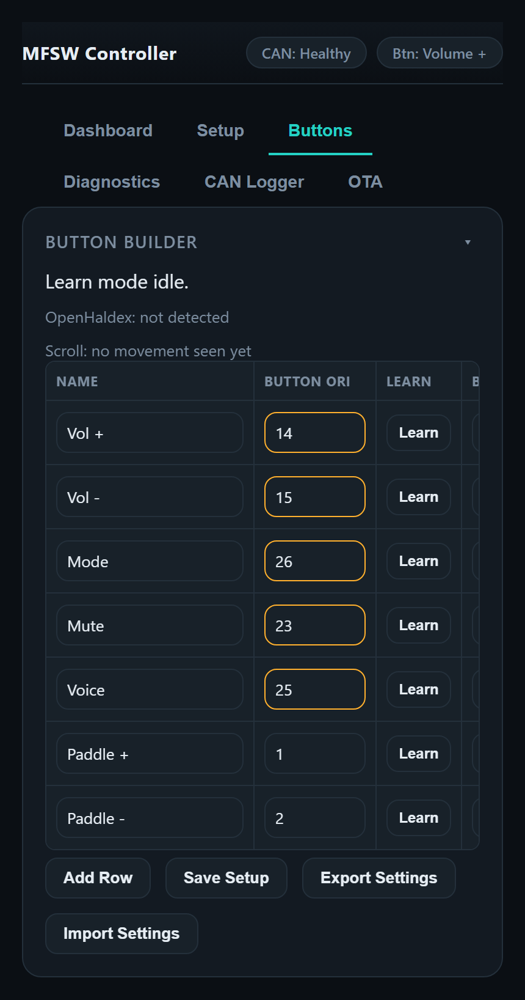
  &nbsp;&nbsp;
  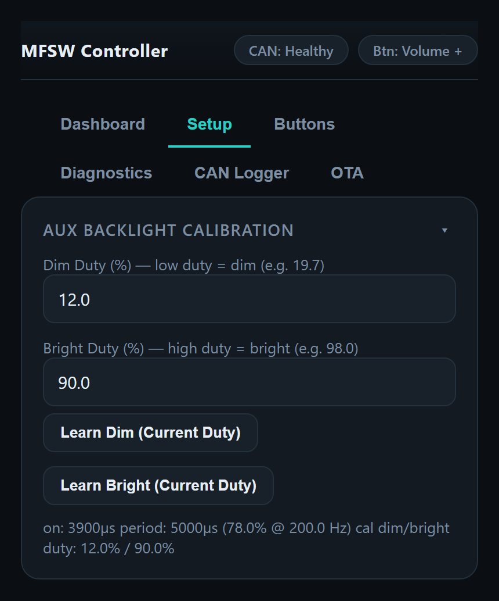
</p>

*Buttons: the mapping table with a Learn button per LIN column (left); Setup → Aux Backlight Calibration with Learn Dim / Learn Bright and the live on-time, period and duty readout (right).*

---

## Installing a New Wheel (Transposing Buttons)

The controller sits between the wheel and the car and **translates each press**: the code a
button reports on the wheel bus (**Button ID_LIN — original**) is re-emitted as the code your
car/radio already understands (**Button ID_LIN — new**). Fitting a different wheel is therefore
a two-pass Learn: first record the target codes the car expects from the **old** wheel, then
record what the **new** wheel sends so every new-wheel press is transposed onto those targets.

### 1. Capture the target codes from the old wheel

With the **original** wheel still on the LIN bus:

1. Set **Setup → Wheel Protocol** to match the old wheel (PQ or MQB, plus the MQB activation
   preset if needed) so it reports buttons.
2. In **Buttons**, for each function press **Learn** on that row's **Button ID_LIN (new)**
   column, then press the button on the wheel. This records the code the car expects into the
   *new* column. Paddles (byte 6) and horn (byte 7) capture on their own bytes automatically —
   use the dedicated **Paddles (both)** and **Horn** rows.
3. Repeat for every button you want to carry over, then **Buttons → Export** the configuration
   as a backup.

> If you already know the codes your car expects (e.g. transposing on the same car), you can
> type them straight into the **new** column instead of this Learn pass.

### 2. Fit the new wheel

1. Power down and swap in the new wheel, wiring its LIN, backlight, paddles and horn.
2. Set **Setup → Wheel Protocol** to match the **new** wheel; pick the MQB activation preset if
   it's an MQB wheel so it unlocks its button report.

### 3. Learn the new wheel's buttons

On each row, press **Learn** on the **Button ID_LIN (original)** column, then press the matching
button on the new wheel. This records what the new wheel sends into the *original* column, so:

```
new wheel press → matched on "original" ID → re-emitted as the car's expected "new" code
                                             (LIN / CAN / resistive / high-side outputs)
```

If a button isn't captured, watch the **LIN Monitor** (Diagnostics) while pressing it to find
the frame and byte that change, then Learn or type the value in manually. Export the finished
map so you can restore it after a firmware update.

---

## Incoming LIN IDs

The controller acts as the **LIN master**: it sends a frame header for a specific
protected ID and the wheel (the slave) answers. It therefore only "hears" a wheel that
responds on the IDs it polls. Different wheels and gateways use different IDs, so all four
incoming IDs are user-configurable from the **Setup** tab:

| Frame | Setting | Default |
| --- | --- | --- |
| Button | `Button ID_LIN in` | `0x0E` |
| Accessory buttons | `Accessory ID_LIN in` | `0x0F` |
| Temperature | `Temperature ID_LIN in` | `0x3A` |
| Light / dimming | `Light ID_LIN in` | `0x0D` |

The button and accessory frames feed the same mapping pipeline, so accessory buttons behave
exactly like the main buttons. The temperature frame is captured for the monitor only.
Setting an ID to `00` disables polling of that frame.

If a wheel's buttons aren't recognised, watch the **LIN Monitor** (Diagnostics) while
pressing them: every frame whose bytes change is logged with its ID and data, so you can
spot the button frame and set **Button ID_LIN in** to match.

---

## LIN Monitor

The **LIN Monitor** card on the **Diagnostics** tab shows a rolling event log fed by the
firmware — every LIN frame whose bytes change is logged with its ID and 8 data bytes, plus
button/accessory press events (tagged `[SW]`), each with a millisecond timestamp. Use
**Auto-scroll** to follow the tail, **Export (CSV)** to download the full buffered log, and
**Clear** to reset it.

**Passthru Mode** (toggle on the same card) switches the monitor from "successful, changed
frames only" to logging **every** poll/send attempt on every polled ID — success or failure,
any length, including timeouts and checksum errors — as `LIN1`/`LIN2` lines noting the
requested checksum version, a precise failure reason, length and raw bytes, e.g.:

```
LIN1 0x0E v2 OK len=8: 00 02 00 00 00 00 00 00
LIN2 0x0D v2 TIMEOUT len=4: 00 00 00 00
LIN1 0x0E v2 CHK len=8: 00 1A 00 00 00 00 00 3F
```

While enabled it also bypasses the mapping/protocol-shaping process entirely — button and
light frames are relayed unmodified between the wheel and chassis buses (the button frame
under the *same* ID it was received on, a genuine mirror rather than a re-encoding) instead
of being mapped and reshaped, so it doubles as a raw bench-test bridge. Off by default and
**not persisted** — always off after a reboot.

<p align="center">
  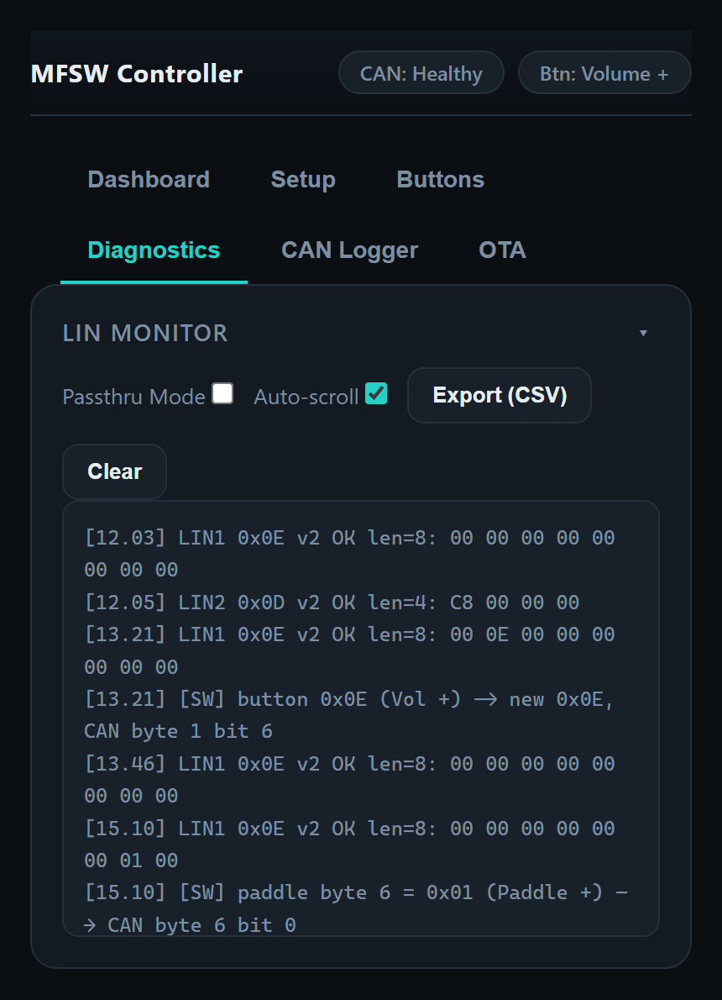
</p>

---

## CAN Logger

The **CAN Logger** tab does for the CAN bus what the LIN Monitor does for LIN. The **CAN
Monitor** card records frames seen on the bus with a millisecond timestamp, ID and the 8 data
bytes. It is off by default and never persisted. With no filter it records each distinct ID
*once* — a quick way to see what a bus carries without a busy 500 kbit/s bus filling the
300-frame buffer in under a second — or set a **Filter ID** to follow one message and tick
**Only on change** to log it only when its bytes differ. **Export (CSV)** writes SavvyCAN's
column order so the file opens there directly.

The **SavvyCAN Analyzer** card on the same tab forwards *all* traffic live to
[SavvyCAN](https://www.savvycan.com/) over WiFi (GVRET, `192.168.1.1:23`) or over the USB
serial port — with no buffer limit, so use it rather than the monitor for a full capture. The
two are mutually exclusive, and serial mode reopens the USB port at 1 Mbaud, so the debug
console is unusable while it runs.

<p align="center">
  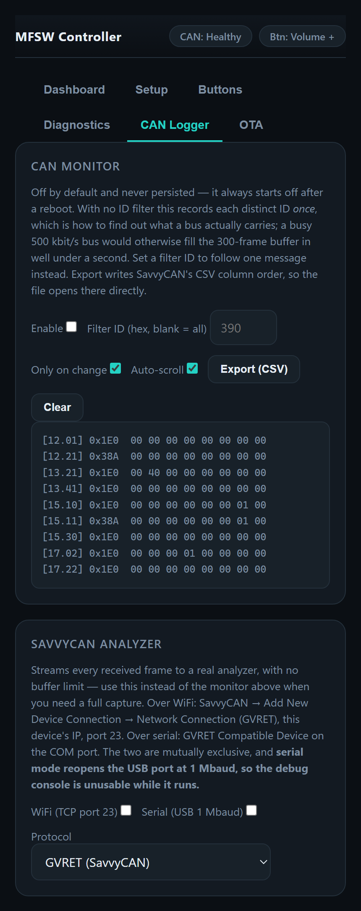
</p>

---

## Legacy PCB Support

Early boards route the LIN transceivers with **RX and TX reversed** on both channels. Enable
**Legacy PCB (swap LIN RX/TX)** on the **Setup** tab to flip both LIN 1 and LIN 2 back to the
correct orientation. The pins are configured once at start-up, so a **reboot is required**
for the change to take effect. Leave it off for current boards.

---

## Power Management

The firmware bundles the universal `power_manager` module that is used across most of the projects and works by monitoring **1 minute
after the last Wi-Fi client disconnects**. Once there are no WiFi clients, the CPU power and WiFi is disabled, reducing power consumption.

| Action | Saving |
| --- | --- |
| Wi-Fi radio off | ~80–120 mA average (single biggest) |
| CPU 240 MHz → 80 MHz | Moderate reduction in active current |
| Bluetooth controller released at boot | ~60 KB RAM freed; small idle saving |
| Onboard LED off at boot | Tiny but persistent saving |

A power-cycle (ignition off/on) brings Wi-Fi back. 

---

## Configuration

### Feature Flags

| Define | Default | Effect |
| --- | --- | --- |
| `ENABLE_DEBUG` | on | Mirror `DEBUG(...)` output to Serial |
| `hasCAN` | 1 | Compile in CAN/TWAI output and RX |
| `hasResistiveStereo` | 1 | Compile in the X9C10X resistive output |
| `hasAuxLight` | 1 | Default the backlight source to the aux PWM input |
| `ChassisCANDebug` | 0 | Print every received CAN frame |
| `detailedDebugWiFi` | 0 | Print Wi-Fi events |

### Key Defaults

| Setting | Default |
| --- | --- |
| CAN broadcast ID | `0x1E0` |
| CAN hold window | 250 ms |
| LIN baud / poll | 19.2 kbit/s / 100 ms |
| Aux dim / bright duty | 19.7 % / 98.0 % |
| Backlight max (LIN) | `0x7F` |
| Base resistance | 10 kΩ |
| Wi-Fi AP / IP | `MFSWController` / `192.168.1.1` |

---

## Version History

The firmware version (`FW_VERSION` in [include/defs.h](include/defs.h)) is shown on the
OTA tab. The full history lives in
[include/ver.h](include/ver.h):

```
Unreleased — Independent Chassis Protocol (PQ/MQB) for the chassis-bound button frame,
        separate from Wheel Protocol, so any wheel↔chassis combination bridges; a
        protocol-change prompt updates button rows still on a known PQ/MQB code and
        leaves learned/customised rows alone; Dashboard "BCM" tile + raw BCM data,
        independent of the active backlight source; LIN 2 health split into "any
        transaction" vs "light frame specifically"; LIN Monitor CSV export; Passthru
        Mode (relays frames unmodified, logs every attempt including failures);
        removed two leftover "Discover LIN IDs" UI references to the scanner
        retired in V1.03; "PNP" wording unified to "High-Side MOSFET"
V1.04 — Adopted the shared Forbes Automotive UI theme (common style.css) for a
        standardised look across all products; wifi_manager/ota_manager made
        project-independent (this project is the source of the shared modules);
        two-step OTA (filesystem then firmware) over /api/ota + /api/ota/fs
V1.03 — MQB steering-wheel support: selectable PQ/MQB wheel protocol with a validated
        0x0D backlight activation frame that unlocks the MQB button report; settings
        import/export; retired the interactive LIN ID scanner in favour of the LIN monitor
V1.02 — Configurable incoming LIN IDs (button/accessory/temperature/light) with a
        two-bus LIN ID scanner to discover them; accessory + temperature frame
        polling; live LIN monitor log; Legacy PCB RX/TX swap option
V1.01 — Latch extended to CAN + LIN outputs; OpenHaldex mode control per button
        (fixed or Push-to-Next) with closed-loop CAN confirmation
V1.00 — initial release
```

---

## Disclaimer

Forbes Automotive accepts no responsibility for any incidents arising from the use of this
adapter. Frame IDs, resistances and calibration are vehicle-specific — verify against your
own hardware before relying on any output.
